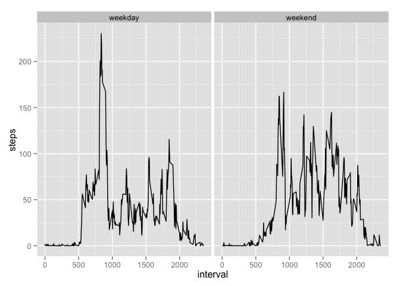

# Reproducible Research: Peer Assessment 1


## Loading and preprocessing the data
The data will be read into a variable named 'data'.

```r
data <- read.csv(unz("activity.zip", 'activity.csv'))
```

Import libraries.

```r
library(dplyr)
library(xtable)
library(ggplot2)
```

## What is mean total number of steps taken per day?
**1. Total number of steps**
Total steps per day is:

```r
total_daily_steps <- summarise(
  group_by(data, date),
  daily_steps = sum(steps, na.rm = TRUE)
  )
print(xtable(total_daily_steps), type='html')
```

<!-- html table generated in R 3.1.1 by xtable 1.7-3 package -->
<!-- Tue Feb  3 20:50:26 2015 -->
<TABLE border=1>
<TR> <TH>  </TH> <TH> date </TH> <TH> daily_steps </TH>  </TR>
  <TR> <TD align="right"> 1 </TD> <TD> 2012-10-01 </TD> <TD align="right">   0 </TD> </TR>
  <TR> <TD align="right"> 2 </TD> <TD> 2012-10-02 </TD> <TD align="right"> 126 </TD> </TR>
  <TR> <TD align="right"> 3 </TD> <TD> 2012-10-03 </TD> <TD align="right"> 11352 </TD> </TR>
  <TR> <TD align="right"> 4 </TD> <TD> 2012-10-04 </TD> <TD align="right"> 12116 </TD> </TR>
  <TR> <TD align="right"> 5 </TD> <TD> 2012-10-05 </TD> <TD align="right"> 13294 </TD> </TR>
  <TR> <TD align="right"> 6 </TD> <TD> 2012-10-06 </TD> <TD align="right"> 15420 </TD> </TR>
  <TR> <TD align="right"> 7 </TD> <TD> 2012-10-07 </TD> <TD align="right"> 11015 </TD> </TR>
  <TR> <TD align="right"> 8 </TD> <TD> 2012-10-08 </TD> <TD align="right">   0 </TD> </TR>
  <TR> <TD align="right"> 9 </TD> <TD> 2012-10-09 </TD> <TD align="right"> 12811 </TD> </TR>
  <TR> <TD align="right"> 10 </TD> <TD> 2012-10-10 </TD> <TD align="right"> 9900 </TD> </TR>
  <TR> <TD align="right"> 11 </TD> <TD> 2012-10-11 </TD> <TD align="right"> 10304 </TD> </TR>
  <TR> <TD align="right"> 12 </TD> <TD> 2012-10-12 </TD> <TD align="right"> 17382 </TD> </TR>
  <TR> <TD align="right"> 13 </TD> <TD> 2012-10-13 </TD> <TD align="right"> 12426 </TD> </TR>
  <TR> <TD align="right"> 14 </TD> <TD> 2012-10-14 </TD> <TD align="right"> 15098 </TD> </TR>
  <TR> <TD align="right"> 15 </TD> <TD> 2012-10-15 </TD> <TD align="right"> 10139 </TD> </TR>
  <TR> <TD align="right"> 16 </TD> <TD> 2012-10-16 </TD> <TD align="right"> 15084 </TD> </TR>
  <TR> <TD align="right"> 17 </TD> <TD> 2012-10-17 </TD> <TD align="right"> 13452 </TD> </TR>
  <TR> <TD align="right"> 18 </TD> <TD> 2012-10-18 </TD> <TD align="right"> 10056 </TD> </TR>
  <TR> <TD align="right"> 19 </TD> <TD> 2012-10-19 </TD> <TD align="right"> 11829 </TD> </TR>
  <TR> <TD align="right"> 20 </TD> <TD> 2012-10-20 </TD> <TD align="right"> 10395 </TD> </TR>
  <TR> <TD align="right"> 21 </TD> <TD> 2012-10-21 </TD> <TD align="right"> 8821 </TD> </TR>
  <TR> <TD align="right"> 22 </TD> <TD> 2012-10-22 </TD> <TD align="right"> 13460 </TD> </TR>
  <TR> <TD align="right"> 23 </TD> <TD> 2012-10-23 </TD> <TD align="right"> 8918 </TD> </TR>
  <TR> <TD align="right"> 24 </TD> <TD> 2012-10-24 </TD> <TD align="right"> 8355 </TD> </TR>
  <TR> <TD align="right"> 25 </TD> <TD> 2012-10-25 </TD> <TD align="right"> 2492 </TD> </TR>
  <TR> <TD align="right"> 26 </TD> <TD> 2012-10-26 </TD> <TD align="right"> 6778 </TD> </TR>
  <TR> <TD align="right"> 27 </TD> <TD> 2012-10-27 </TD> <TD align="right"> 10119 </TD> </TR>
  <TR> <TD align="right"> 28 </TD> <TD> 2012-10-28 </TD> <TD align="right"> 11458 </TD> </TR>
  <TR> <TD align="right"> 29 </TD> <TD> 2012-10-29 </TD> <TD align="right"> 5018 </TD> </TR>
  <TR> <TD align="right"> 30 </TD> <TD> 2012-10-30 </TD> <TD align="right"> 9819 </TD> </TR>
  <TR> <TD align="right"> 31 </TD> <TD> 2012-10-31 </TD> <TD align="right"> 15414 </TD> </TR>
  <TR> <TD align="right"> 32 </TD> <TD> 2012-11-01 </TD> <TD align="right">   0 </TD> </TR>
  <TR> <TD align="right"> 33 </TD> <TD> 2012-11-02 </TD> <TD align="right"> 10600 </TD> </TR>
  <TR> <TD align="right"> 34 </TD> <TD> 2012-11-03 </TD> <TD align="right"> 10571 </TD> </TR>
  <TR> <TD align="right"> 35 </TD> <TD> 2012-11-04 </TD> <TD align="right">   0 </TD> </TR>
  <TR> <TD align="right"> 36 </TD> <TD> 2012-11-05 </TD> <TD align="right"> 10439 </TD> </TR>
  <TR> <TD align="right"> 37 </TD> <TD> 2012-11-06 </TD> <TD align="right"> 8334 </TD> </TR>
  <TR> <TD align="right"> 38 </TD> <TD> 2012-11-07 </TD> <TD align="right"> 12883 </TD> </TR>
  <TR> <TD align="right"> 39 </TD> <TD> 2012-11-08 </TD> <TD align="right"> 3219 </TD> </TR>
  <TR> <TD align="right"> 40 </TD> <TD> 2012-11-09 </TD> <TD align="right">   0 </TD> </TR>
  <TR> <TD align="right"> 41 </TD> <TD> 2012-11-10 </TD> <TD align="right">   0 </TD> </TR>
  <TR> <TD align="right"> 42 </TD> <TD> 2012-11-11 </TD> <TD align="right"> 12608 </TD> </TR>
  <TR> <TD align="right"> 43 </TD> <TD> 2012-11-12 </TD> <TD align="right"> 10765 </TD> </TR>
  <TR> <TD align="right"> 44 </TD> <TD> 2012-11-13 </TD> <TD align="right"> 7336 </TD> </TR>
  <TR> <TD align="right"> 45 </TD> <TD> 2012-11-14 </TD> <TD align="right">   0 </TD> </TR>
  <TR> <TD align="right"> 46 </TD> <TD> 2012-11-15 </TD> <TD align="right">  41 </TD> </TR>
  <TR> <TD align="right"> 47 </TD> <TD> 2012-11-16 </TD> <TD align="right"> 5441 </TD> </TR>
  <TR> <TD align="right"> 48 </TD> <TD> 2012-11-17 </TD> <TD align="right"> 14339 </TD> </TR>
  <TR> <TD align="right"> 49 </TD> <TD> 2012-11-18 </TD> <TD align="right"> 15110 </TD> </TR>
  <TR> <TD align="right"> 50 </TD> <TD> 2012-11-19 </TD> <TD align="right"> 8841 </TD> </TR>
  <TR> <TD align="right"> 51 </TD> <TD> 2012-11-20 </TD> <TD align="right"> 4472 </TD> </TR>
  <TR> <TD align="right"> 52 </TD> <TD> 2012-11-21 </TD> <TD align="right"> 12787 </TD> </TR>
  <TR> <TD align="right"> 53 </TD> <TD> 2012-11-22 </TD> <TD align="right"> 20427 </TD> </TR>
  <TR> <TD align="right"> 54 </TD> <TD> 2012-11-23 </TD> <TD align="right"> 21194 </TD> </TR>
  <TR> <TD align="right"> 55 </TD> <TD> 2012-11-24 </TD> <TD align="right"> 14478 </TD> </TR>
  <TR> <TD align="right"> 56 </TD> <TD> 2012-11-25 </TD> <TD align="right"> 11834 </TD> </TR>
  <TR> <TD align="right"> 57 </TD> <TD> 2012-11-26 </TD> <TD align="right"> 11162 </TD> </TR>
  <TR> <TD align="right"> 58 </TD> <TD> 2012-11-27 </TD> <TD align="right"> 13646 </TD> </TR>
  <TR> <TD align="right"> 59 </TD> <TD> 2012-11-28 </TD> <TD align="right"> 10183 </TD> </TR>
  <TR> <TD align="right"> 60 </TD> <TD> 2012-11-29 </TD> <TD align="right"> 7047 </TD> </TR>
  <TR> <TD align="right"> 61 </TD> <TD> 2012-11-30 </TD> <TD align="right">   0 </TD> </TR>
   </TABLE>


**2. Histogram of number of steps per day**

```r
hist(total_daily_steps$daily_steps, main = "Histogram of Total Steps per Day", xlab="steps", ylab="frequency")
```

 

**3. Mean and median of steps per day**

```r
avg_steps <- mean(total_daily_steps$daily_steps)
median_steps <- median(total_daily_steps$daily_steps)
```
- Average steps per day is 9354.2295
- Median steps per day is 10395

## What is the average daily activity pattern?
**1. Make a time series plot, of the 5-minute interval (x-axis) and the average number of steps taken, averaged across all days (y-axis)**

```r
steps_by_interval <- summarise(
  group_by(data, interval),
  steps = mean(steps, na.rm=TRUE)
)

qplot(interval, steps, data=steps_by_interval, geom=c('line'))
```

 

**2. Which 5-minute interval, on average across all the days in the dataset, contains the maximum number of steps?**

```r
max_interval <- filter(steps_by_interval, steps == max(steps_by_interval$steps))$interval[1]
```
The interval with the highest average steps is 835.

## Imputing missing values

```r
missing_values <- dim(filter(data, is.na(steps)))[1]
```

**1. Calculate and report the total number of missing values in the dataset (i.e. the total number of rows with NAs)**  
- There are 2304 missing values in the dataset.

**2. Devise a strategy for filling in all of the missing values in the dataset.**  
A strategy to fill in all of the missing values is to use the daily average of that interval.

**3. Create a new dataset that is equal to the original dataset but with the missing data filled in.**

```r
data_fillna <- merge(data, steps_by_interval, by = c('interval'))
data_fillna$steps <- data_fillna$steps.x
data_fillna$steps[is.na(data_fillna$steps.x)] <- data_fillna$steps.y[is.na(data_fillna$steps.x)]

data_fillna <- data_fillna[, c('steps', 'date', 'interval')]
```

**4. Make a histogram of the total number of steps taken each day and Calculate and report the mean and median total number of steps taken per day**


```r
total_daily_fillna <- summarise(group_by(data_fillna, date),
                                steps = sum(steps)
                                )
avg_daily_fillna <- mean(total_daily_fillna$steps)
median_daily_fillna <- median(total_daily_fillna$steps)

hist(total_daily_fillna$steps, main='Histogram of Daily Steps (fillna)', xlab = 'steps', ylab = 'frequency')
```

 

- The average daily steps after fill na becomes: 1.0766 &times; 10<sup>4</sup>
- The median daily steps after fill na becomes: 1.0766 &times; 10<sup>4</sup>
- Imputing the missing values had more impact on the mean than the median, and lowered the variance in estimating daily average steps.

## Are there differences in activity patterns between weekdays and weekends?
**1. Creating a new weekend flag variable **  

```r
data_fillna$weekday <- 'weekday'
data_fillna$weekday[weekdays(as.Date(data_fillna$date)) == 'Saturday'] <- 'weekend'
data_fillna$weekday[weekdays(as.Date(data_fillna$date)) == 'Sunday'] <- 'weekend'
```

**2. Panel plot of the intervals**  

```r
data_by_weekday <- summarise(
  group_by(data_fillna, weekday, interval),
  steps = mean(steps)
  )
qplot(interval, steps, facets = .~weekday, data=data_by_weekday, geom=c('line'))
```

 
